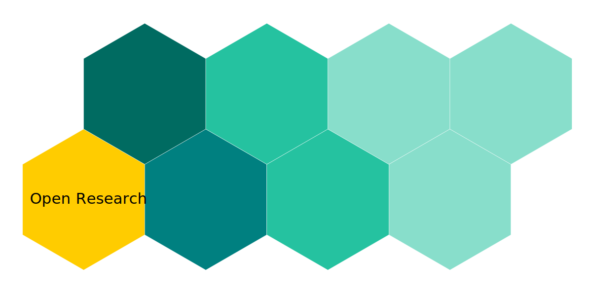

Open Research Library is an ongoing project, and its main framework should be ready at the end of 2022.

{/* truncate */}

Timescale of publishing books:

**Working Title | Type | Date**
Open Source and Open Research | Monography | 03/22
Information Theory | Monography | 03/22
Linux Distro Jungle | Handbook | 08/22
Get Android Will Travel | Handbook | 09/22
Cambridge Quantum SDK | Handbook | 11/22
C | Monography, Anthropology | 02/22

Table of works.

Evolutional Informatics | Monography | 05/22
Neural Cybernetics | Monography | 12/22
