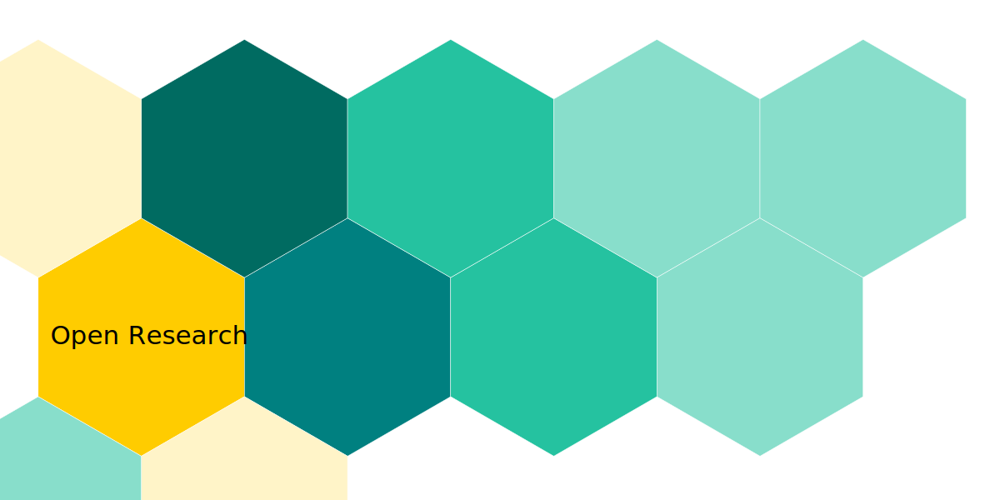

Open Research Library Project is in the test run now. You can read more about it in the News section or take a look at the [Bookshelf](./docs/intro). The project is powered by the [Docusaurus Framework](https://docusaurus.io), all the content is written and formatted in Markdown.

All books are in in the `books` directory, some are organized in subfolders. The content should be easy to print directly from the page. Published works will be also available in standard digital formats.

Thanks for your support!

**Open Research Library Project** is constantly growing, feel free to check back regurarly!  
