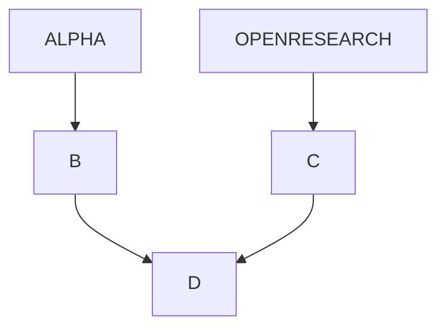
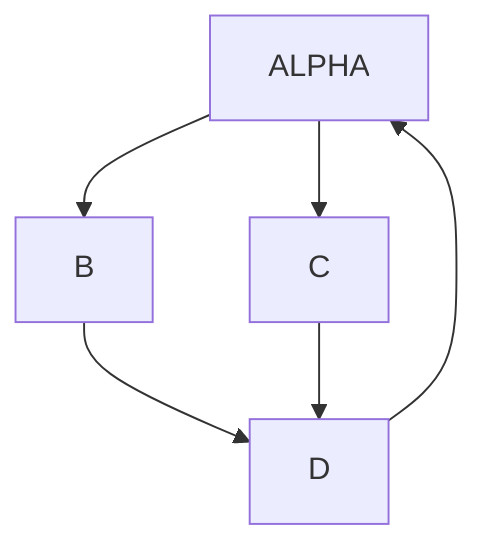
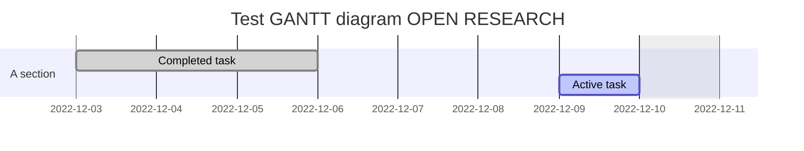
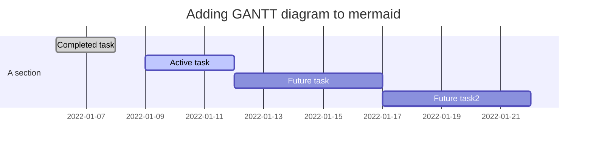
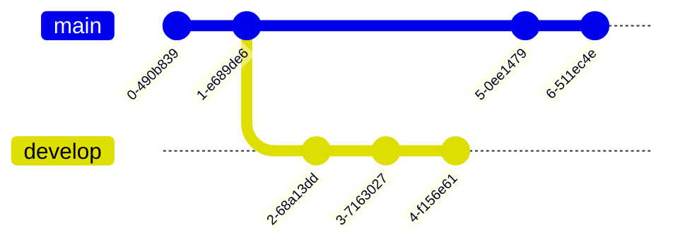

Open Research Project is an incubator and an accelerator of writing in fields of Data Science, Informatics, and Philosophy of Science. Subjects may vary from technical handbooks to theoretical treatises.

Today we installed and tested Mermaid diagrams and visualizations.





Diagrams and chart parser in markdown:





Git Diagrams:



State Diagrams:

```mermaid

stateDiagram-v2
    state if_state <<choice>>
    [*] --> IsPositive
    IsPositive --> if_state
    if_state --> False: if n < 0
    if_state --> True : if n >= 0

      ```
