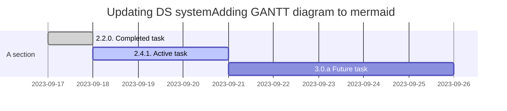

Update of DS to 2.4.1
Today we installed new version of documentation system and development server (new features), preparing for 3.0.

Diagrams and chart parser test in markdown:

```mermaid
gantt
dateFormat  YYYY-MM-DD
title Updating DS systemAdding GANTT diagram to mermaid
excludes weekdays 2014-01-10

section A section
2.2.0. Completed task            :done,    des1, 2023-09-17,2023-09-18
2.4.1. Active task               :active,  des2, 2023-09-18, 3d
3.0.a Future task               :         des3, after des2, 5d
```

