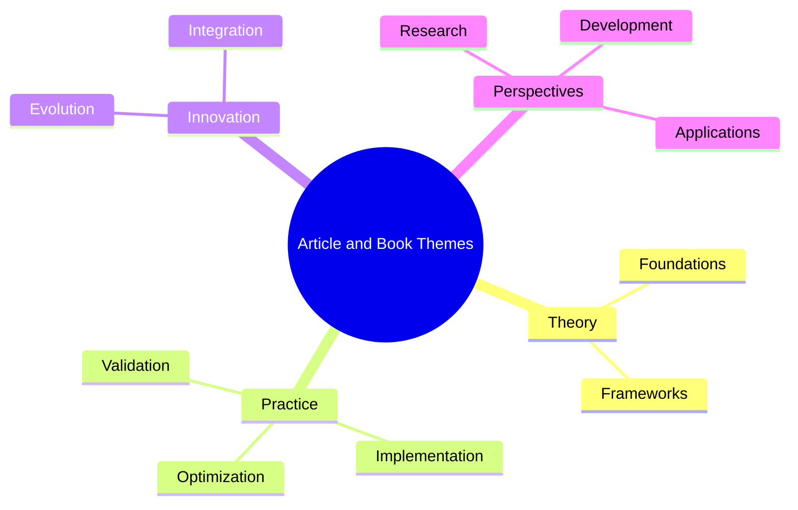
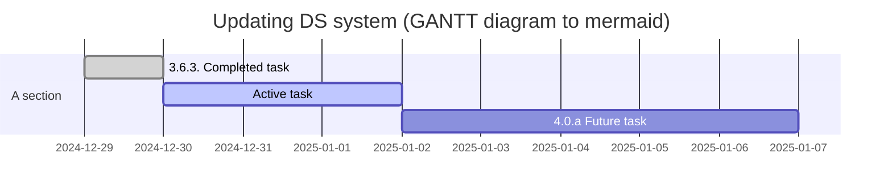

Update of DS site to 3.6.3
Today we installed new major upgrade version of documentation system and development server (new features, MDX3, https://docusaurus.io/docs/migration/v3), preparing for 4.0a next year.

## Diagrams

Diagrams, mindmaps, and chart parser tests in markdown:

