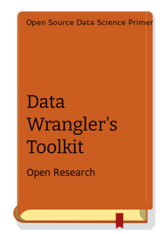

# Data Wrangler's Toolkit
## Abstract
This practical handbook shows basic principles of data processing and visualization.

:::info what you will learn?
We will learn basics of:
- Data Management
- Data Wrangling
- R
- Python
- Jupyter Notebooks
- Orange Data Visualization
:::

We will use **Anaconda** Python distribution platform and **conda** as package manager. The instructions will be for Windows and Linux installations.

## What's next?

- Data Science Basics
- Data Collection

## Cover

