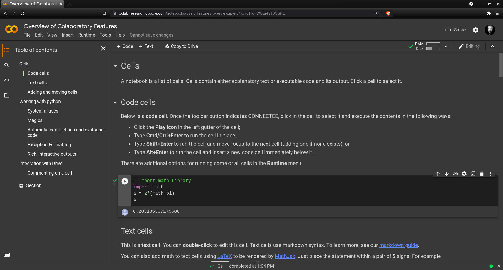
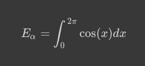

# Research with Google Colaboratory
You may run Jupyter notebooks in a cloud:

https://colab.research.google.com/

## Start




### Code Cells and Text Cells
You can insert code in the cell and run it. Try the following code:

```bash
# Import math Library
import math
a = 2*(math.pi)
a
```

- Connect the notebook with the Connect button
- Run the script. The output should be the value of *"a"* rounded, 6.283185307179586
- mathematical expressions are entered into *text cells* with LaTeX syntax via MathJax (just enclose the LaTeX expression with $, for equation block use $$)


```bash
$$E_\alpha = \int_0^{2\pi} \cos(x) dx $$

```



- you can move cells up and down, and add them with
- list of cells

### Python
- allocating resources
- shortcuts are combined, like <kbd>Ctrl+M</kbd>+<kbd>I</kbd> to interrupt a process, or <kbd>Ctrl+M</kbd>+<kbd>Z</kbd> to undo

## Data Management and Workflow

Note that GC is integrated with Google Drive.

- import and format data
- share data
- train model
- create prediction

## Deploy

## Google Colab for Data Science Examples

```bash
pip install neuralprophet
```

```bash
pip install neuralprophet[live]
```

- test data

:::note
Goals.
:::
:::info
Goals.
:::
:::caution
Goals.
:::
:::warning
Goals.
:::

import Tabs from '@theme/Tabs';

import TabItem from '@theme/TabItem';

:::tip Use tabs in admonitions

<Tabs
  defaultValue="apple"
  values={[
    {label: 'Apple', value: 'apple'},
    {label: 'Orange', value: 'orange'},
    {label: 'Banana', value: 'banana'},
  ]}>
  <TabItem value="apple">This is an apple 🍎

  ```bash
  npm run build
  ```
  </TabItem>
  <TabItem value="orange">This is an orange 🍊</TabItem>
  <TabItem value="banana">This is a banana 🍌</TabItem>
</Tabs>

:::

```md title="docs/hello.md"
# Hello

This is my **first Docusaurus document**!
```

```bash
# Hello

This is my **first Docusaurus document**!
```

<details><summary>CLICK ME</summary>
<p>

#### yes, even hidden code blocks!
chaptertest

```python
print("hello world!")
```

</p>
</details>

Em Dash (—) En Dash (–)
<kbd>Ctrl</kbd>+<kbd>Alt</kbd>+<kbd>0</kbd>

**Soubor ‣ Nový ‣ Obecné**. (*File ‣ New ‣ General*)
