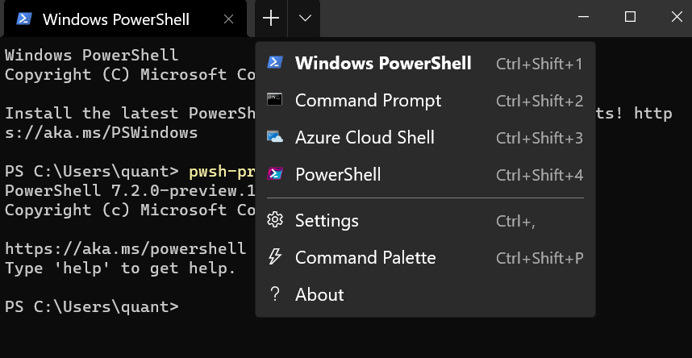
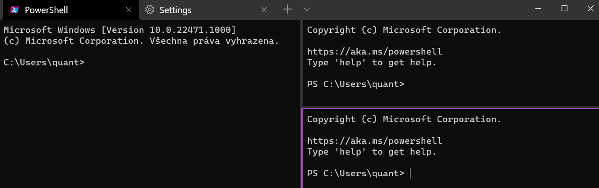
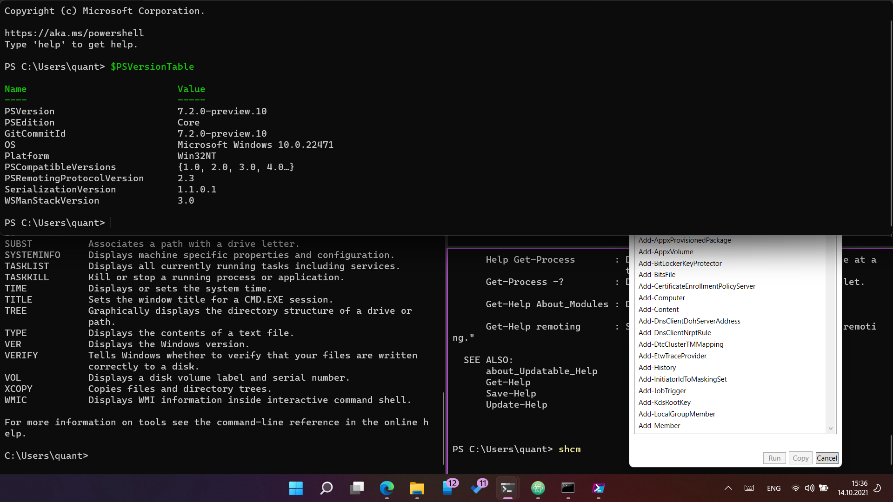
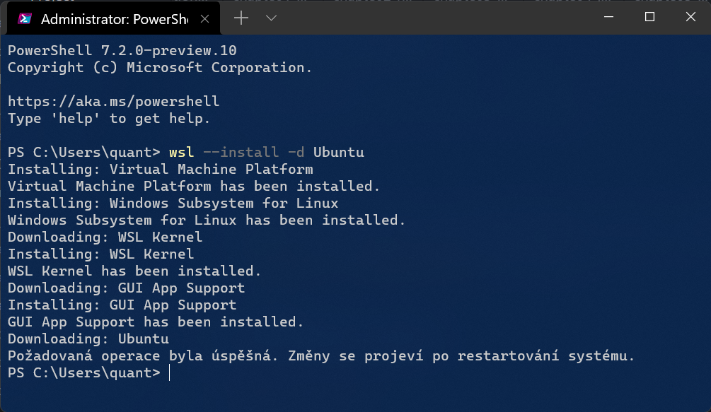
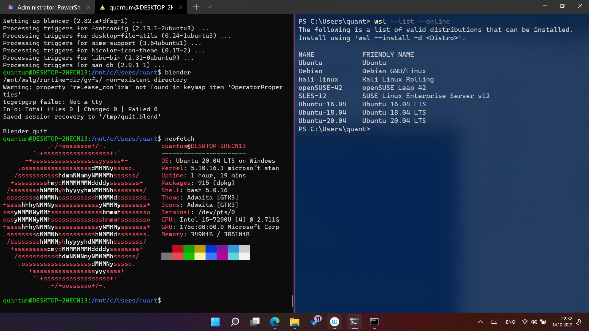

# Addendum: Windows and Linux Tips
In this section you will find some tips useful to both Linux and Windows users.

## Powershell for Data Science

On W11, you have already installed Windows Terminal and Powershell 5.1 (older stable), which can be run by command `powershell`. It is residing in **$env:Windows\System32\WindowsPowerShell**. You can check Powershell version by command `$PSVersionTable`.

You  can install development version into **$env:ProgramFiles\PowerShell\7**:

```bash
winget install --id microsoft.powershell.preview
```
You can run this version with `pwsh-preview` command from any terminal.



You can switch shell environments by shortcuts or dropdown menu. In **Settings**, you can change the default behavior, colors, font, background image, and acrylic effects.



You can split Terminal window vertically with <kbd>Alt</kbd>+<kbd>Shift</kbd>+<kbd>+</kbd> and horizontally with <kbd>Alt</kbd>+<kbd>Shift</kbd>+<kbd>-</kbd>.

You can run additional Quake style top terminal with <kbd>Win</kbd>+<kbd>\`</kbd>




### Basic Commands
- `schcm` Show-Command to show commands
- Systeminfo
- Get-WmiObject Win32_VideoController | Select description,driverversion

### Cmdlets
### Powershell ISE
### Using  Powershell in Examples
- ConvertTo-Csv
- Format-Table ft
- data conversion


## Linux on Windows
You can run Linux apps directly from Windows environment. Windows Subsystem for Linux GUI (WSLg) is subsystem for displaying X11 and Wayland GUI applications.

### WSL and WSLg

Running Linux Apps on Windows.
### Installing Linux on Windows?

:::info Graphic drivers for WSL
You may need an installation of dedicated latest graphic drivers (Intel, NVidia, AMD) for OPENGL support on WSLg Linux

|        | Experimental WSL Driver                                                            |
|--------|------------------------------------------------------------------------------------|
| Intel  | https://downloadcenter.intel.com/download/30579/Intel-Graphics-Windows-DCH-Drivers |
| NVIDIA | https://developer.nvidia.com/cuda/wsl                                              |
| AMD    | https://www.amd.com/en/support/kb/release-notes/rn-rad-win-wsl-support             |
|        |                                                                                    |

In case of error message (**OEM Lock**), proceed as follows:
1. Download the (latest) version of driver
2. Disconnect from the internet
3. Open Device Manager
4. Find the Graphic Adapter, right click it and choose Remove device from the menu
5. Install the latest driver and reboot

:::

You may choose from Linux distributions for WSL. Enter `wsl --list --online`. To install the selected distro (Ubuntu, Debian etc.), open **Terminal as administrator** and enter:

```bash
wsl --update
```
```bash
wsl --install -d Ubuntu
```


Restart the system. After the installation finishes, restart again.



:::note
Snap package manager (snapd) although is not yet functional in WSLg. You can install apps via `sudo apt install` only (in the Ubuntu case).  
:::
#### More info:

https://github.com/microsoft/wslg

### Useful Apps

Apps for Linux *can* run in window GUI; graphically demanding apps are  slower. Some are reasonably stable, until the window is  resized considerably.

The WSLg mode is usefull for scientific applications and utilities. The ability to run bash commands quickly is great for testing and exploring.


```bash
pip install neuralprophet
```

```bash
pip install neuralprophet[live]
```

- test data

:::note
Goals.
:::
:::info
Goals.
:::
:::caution
Goals.
:::
:::warning
Goals.
:::

import Tabs from '@theme/Tabs';

import TabItem from '@theme/TabItem';

:::tip Use tabs in admonitions

<Tabs
  defaultValue="apple"
  values={[
    {label: 'Apple', value: 'apple'},
    {label: 'Orange', value: 'orange'},
    {label: 'Banana', value: 'banana'},
  ]}>
  <TabItem value="apple">This is an apple 🍎

  ```bash
  npm run build
  ```
  </TabItem>
  <TabItem value="orange">This is an orange 🍊</TabItem>
  <TabItem value="banana">This is a banana 🍌</TabItem>
</Tabs>

:::

```md title="docs/hello.md"
# Hello

This is my **first Docusaurus document**!
```

```bash
# Hello

This is my **first Docusaurus document**!
```

<details><summary>CLICK ME</summary>
<p>

#### yes, even hidden code blocks!
chaptertest

```python
print("hello world!")
```

</p>
</details>

Em Dash (—) En Dash (–)
<kbd>Ctrl</kbd>+<kbd>Alt</kbd>+<kbd>0</kbd>

**Soubor ‣ Nový ‣ Obecné**. (*File ‣ New ‣ General*)
