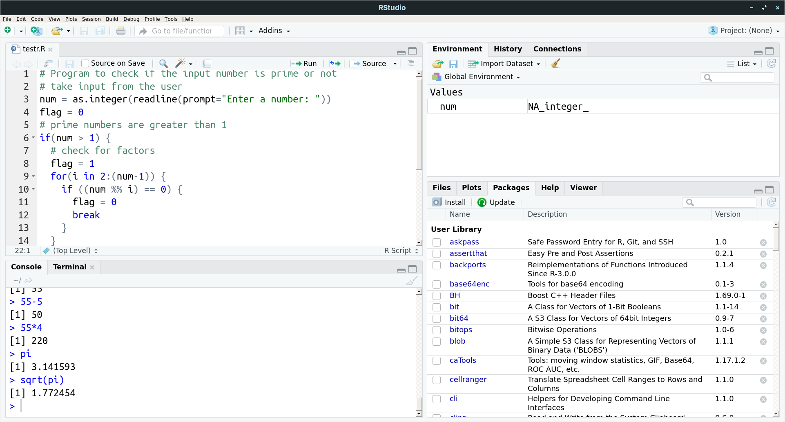
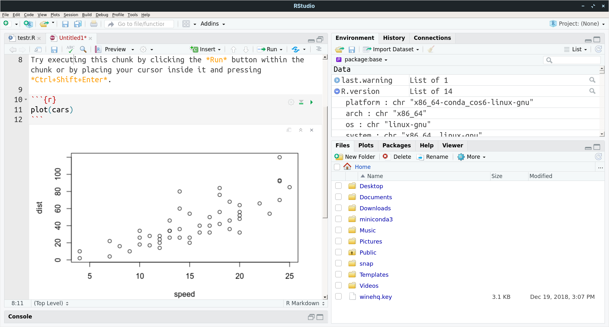

# R Primer
Basics of R. Programming with statistical analysis. Advantages of R. Special commands and data processing.
- using R Studio
- using Jupyter
- data processing
## RStudio Installation

You may install RStudio from Anaconda Navigator. You need to create a new enviroment for it (you will also get the option during the installation into root environment).

## R Notebooks

RStudio can work with **R Markdown Notebooks**. Notebooks join text and code to create formatted interactive presentation, able to work even with streaming data.

## R Commands

## R Usage

## Sorting Data with R

## Using R with Jupyter

:::note
Goals.
:::
:::info
Goals.
:::
:::caution
Goals.
:::
:::warning
Goals.
:::
