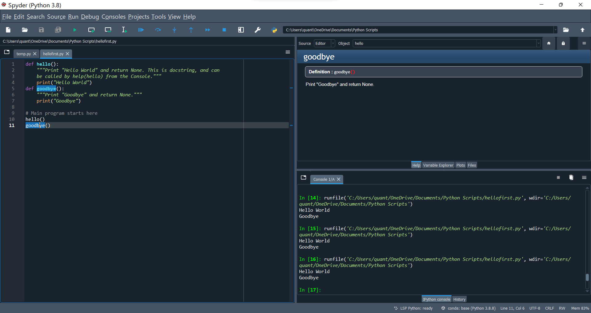

# Python Primer


Fundamentals and practice in Python.
- using Spyder
- run Spyder from Anaconda Navigator

## Functions
- Calling of functions

```bash
def hello():
    """Print "Hello World" and return None. This is docstring, and can be called by help(hello) from the Console."""
    print("Hello World")

# Main program starts here
hello()

```

- this way the function is defined for the Console and can be called again
- sessions
- visibility in current namespace
- <kbd>Ctrl</kbd>+<kbd>I</kbd> information about function
- function needs to be run to update, saving file is not enough
- <kbd>F5</kbd> to run, <kbd>F9</kbd> to run selected function

## Working with sources

## Working with datafiles

:::note
Goals.
:::
:::info
Goals.
:::
:::caution
Goals.
:::
:::warning
Goals.
:::

import Tabs from '@theme/Tabs';

import TabItem from '@theme/TabItem';

:::tip Use tabs in admonitions

<Tabs
  defaultValue="apple"
  values={[
    {label: 'Apple', value: 'apple'},
    {label: 'Orange', value: 'orange'},
    {label: 'Banana', value: 'banana'},
  ]}>
  <TabItem value="apple">This is an apple 🍎

  ```bash
  npm run build
  ```
  </TabItem>
  <TabItem value="orange">This is an orange 🍊</TabItem>
  <TabItem value="banana">This is a banana 🍌</TabItem>
</Tabs>

:::

```md title="docs/hello.md"
# Hello

This is my **first Docusaurus document**!
```

```bash
# Hello

This is my **first Docusaurus document**!
```

<details><summary>CLICK ME</summary>
<p>

#### yes, even hidden code blocks!
chaptertest

```python
print("hello world!")
```

</p>
</details>

Em Dash (—) En Dash (–)
<kbd>Ctrl</kbd>+<kbd>Alt</kbd>+<kbd>0</kbd>

**Soubor ‣ Nový ‣ Obecné**. (*File ‣ New ‣ General*)
