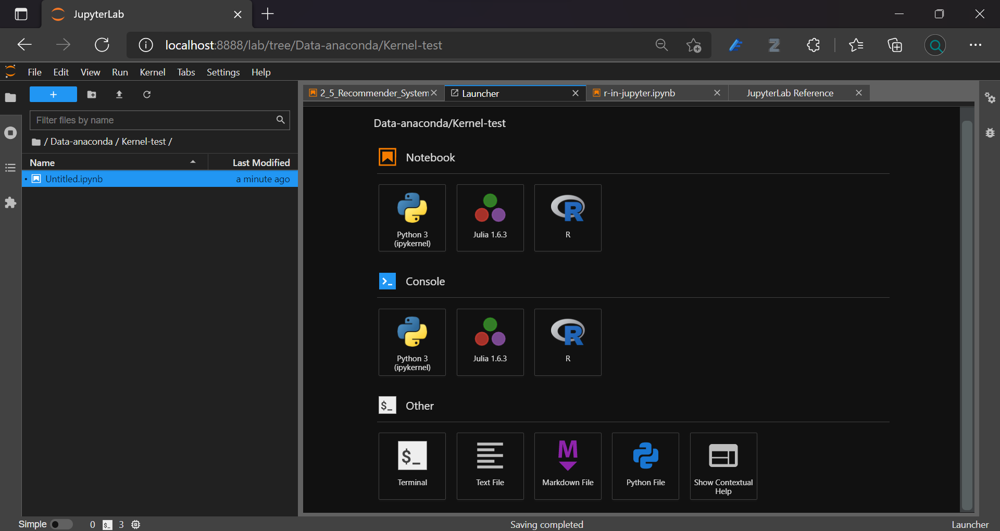

# Introducing Jupyter Notebook and Jupyter Lab

Fundamentals and practice in Jupyter Notebook and Jupyter Lab.

Jupyter notebook is an interactive environment for computation. It supports Julia, R, Python, and various other kernels. Jupyter Lab is a modular user interface.

- writing and running Jupyter Notebooks


## Adding Kernels for Python, R, and Julia



Default kernel in JupyterLab is Python (ipykernel). You can run JupyterLab notebook in different kernels.

### R

To install the kernel for R, **use Anaconda Prompt** command for an active environment, default is *base* (root):

```
conda install -c r r-essentials
```

### Julia

For Julia kernel, create new Python environment (f.i. julia-env), change active environment `activate julia-env`.

Download and install the current version from https://julialang.org/downloads/.

Run Julia. In Julia command line enter:

```
using Pkg
Pkg.add("IJulia")
```

After installation, the kernel option will show in JupyterLab.

- enter Julia Pkg REPL-mode with <kbd>\[</kbd>, exit with <kbd>Backspace</kbd>


## Terminal commands

You can run terminal commands in a cell.

```bash
!conda --version
!conda --help
```

:::note
Goals.
:::
:::info
Goals.
:::
:::caution
Goals.
:::
:::warning
Goals.
:::
