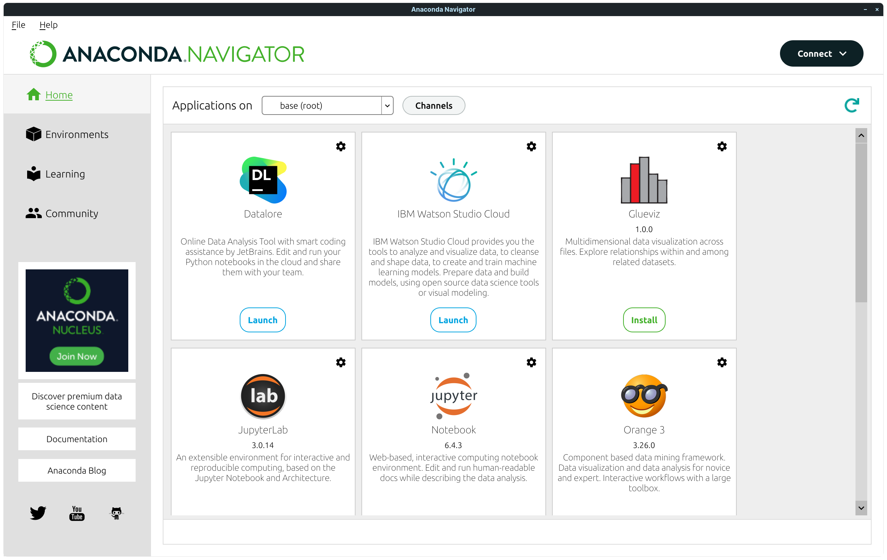

# Installations

What we will need for this book? Package manager and installations of tools needed for data analysis, visualisation and development.

- illustration
- data scraping, data analysis
- Basic Toolbox

:::note
In this book, we will use Anaconda distribution platform and Anaconda Navigator to manage our data science packages. It is good for version management and general overview of packages installed on your system, especially for a beginner.



:::

In this chapter, we will:
1. Install Anaconda (and learn how to setup Miniconda for the examples)
2. Update and check the software packages
3. Learn how to install packages via Anaconda Terminal and Anaconda Navigator
4. Explore Anaconda Navigator, Channels and Environments

## Anaconda or Miniconda?

Miniconda is minimalized version of Anaconda. You may install any of them, we will setup the environments and software later in the chapter anyways.


import Tabs from '@theme/Tabs';

import TabItem from '@theme/TabItem';

:::info Anaconda and Miniconda Installations

## Windows

For Anaconda installation, run Windows Terminal as Administrator

  ```bash
  winget install anaconda3
  ```
Alternatively, for Miniconda installation:

  ```bash
  winget install miniconda3
  ```
  ```bash
  conda install -c anaconda anaconda-navigator
  ```
  ## Linux

  For Anaconda or Miniconda installation, you will need individual installers. You can download the miniconda installer from https://conda.io/miniconda.html and Anaconda installer from https://www.anaconda.com/products/individual.

  1. Download the .sh installer
  2. Make executable
  3. Choose **Run in terminal** option
  4. Accept license, and confirm running conda init
  5. Go to ~file/miniconda3/bin, open terminal in the directory
  6. Install anaconda navigator:

  ```bash
  conda install -c anaconda anaconda-navigator
  ```

  7. Run Anaconda Navigator
  8. If the window is too zoomed in on your system, go to **File ‣ Preferences** and uncheck *Enable high DPI scaling*. Restart Anaconda Navigator.


 
:::

### Conda Installations of Packages

- R-studio

- Spyder Python

- Jupyter Notebook, Jupyter Lab

- Orange Data Visualization


```bash
conda install -c anaconda spyder
```
## Update
```bash
conda update --all -y
```
```bash
conda update conda
conda install anaconda=VersionNumber
```

## Meet Anaconda Navigator

:::info setup for miniconda users

```bash
conda install -c anaconda anaconda-navigator
```

:::
- image
### Version Management
For some scientific packages, you may need a specific version of programming language or environment.
### Environments
You may create separate environments with separate installations of software, versions, and files.
### Channels
Channels are locations of *software repositories*.

You can add a channel with Channels function of Anaconda-navigator, for instance:

```bash
https://conda.anaconda.org/conda-forge/
```

Or you can use conda command from Anaconda prompt:

```bash
conda config --add channels conda-forge
```

To remove a channel use trash icon in the channels list.


:::note
Goals.
:::
:::info
Goals.
:::
:::caution
Goals.
:::
:::warning
Goals.
:::


