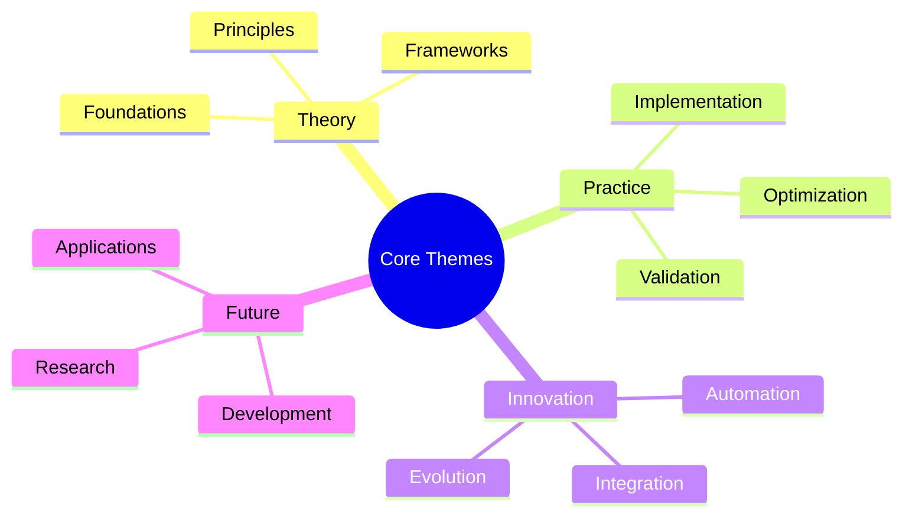
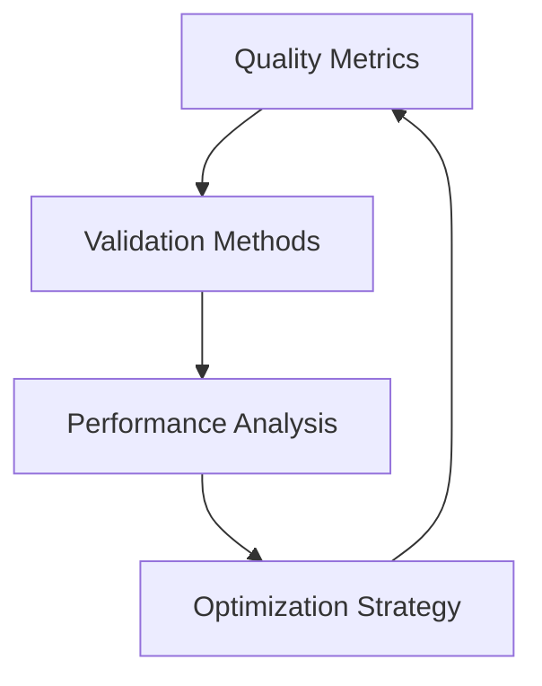

# Systematic Approaches to Prompt Engineering: From Theory to Practice

## Abstract Overview

:::info Book Significance
This comprehensive work represents the first systematic attempt to codify and standardize the field of prompt engineering research, bridging theoretical foundations with practical applications in artificial intelligence.
:::

## Core Themes and Contributions

The emergence of powerful language models has revolutionized how we interact with artificial intelligence, placing prompt engineering at the forefront of AI development. This book presents a groundbreaking framework for understanding, developing, and optimizing prompts through systematic approaches rather than ad-hoc methods.

### Theoretical Foundations

At its core, this work introduces a novel theoretical framework for understanding prompt complexity and effectiveness. Drawing from linguistics, computer science, and cognitive psychology, we present a multi-dimensional approach to analyzing and developing prompts. This framework provides the foundation for systematic improvement in AI interaction design.

:::note Theoretical Innovation
The book introduces the concept of "semantic evolution" in prompt engineering, where prompts can be systematically enhanced while maintaining their core meaning and intent.
:::

### Practical Implementation

Moving beyond theory, the work provides comprehensive guidance for practical implementation. Through detailed case studies and real-world examples, readers learn how to apply theoretical concepts to solve actual challenges in AI development and deployment.

> "The bridge between theoretical understanding and practical application is where true innovation in prompt engineering emerges."

### Automated Systems and Evolution

A significant contribution of this work is the introduction of automated systems for prompt evolution and optimization. These systems represent a paradigm shift from manual prompt crafting to systematic, scalable approaches for generating and improving prompts.

:::tip Implementation Focus
Each theoretical concept is accompanied by practical implementation guidelines and working code examples, making the book immediately useful for practitioners.
:::

### Quality Assurance and Validation

The book presents pioneering frameworks for assessing prompt quality and validating results. These frameworks enable objective comparison of different approaches and provide standardized metrics for measuring improvement.

### Future Directions and Research

Looking forward, the work identifies emerging trends and research opportunities in prompt engineering. It provides a roadmap for future development and highlights areas requiring further investigation.

:::caution Research Opportunities
The field of prompt engineering is rapidly evolving. This book not only captures current best practices but also anticipates future developments and challenges.
:::

## Impact and Applications

The methodologies presented in this book have wide-ranging applications across various domains:

### Industry Applications
The systematic approaches detailed here enable more efficient and effective AI implementation in business contexts, from content generation to complex decision-making systems.

### Research Applications
For researchers, the book provides frameworks for systematic investigation and comparison of different prompt engineering approaches, facilitating more rigorous academic study.

### Development Applications
Developers will find practical tools and methodologies for implementing sophisticated prompt engineering systems in real-world applications.

## Educational Value

:::info Educational Approach
The book is structured to serve both as a comprehensive textbook for academic study and as a practical guide for industry professionals.
:::

The material is presented in a way that builds understanding progressively:
- Fundamental concepts are introduced with clear explanations
- Complex ideas are broken down into manageable components
- Practical examples illustrate theoretical concepts
- Case studies demonstrate real-world applications

## Innovation Highlights

Several groundbreaking concepts are introduced:

### Semantic Preservation Framework
A novel approach to maintaining meaning integrity during prompt evolution and optimization.

### Automated Evolution Systems
Systematic methods for automatically generating and improving prompts while maintaining quality and relevance.

### Universal Rating System
A standardized approach to evaluating prompt complexity and effectiveness across different models and applications.

## Future Vision

The book concludes with a forward-looking perspective on the field's evolution:

:::tip Future Developments
Emerging areas such as neural-symbolic integration and autonomous prompt systems represent exciting opportunities for future research and development.
:::

## Conclusion

This work represents a significant step forward in the field of prompt engineering, providing:
- Comprehensive theoretical foundations
- Practical implementation guidelines
- Innovative automated systems
- Clear paths for future development

> "The future of AI interaction lies not in individual prompts, but in systematic approaches to understanding and developing prompt architectures."

:::note Living Document
As the field continues to evolve, this book serves as a foundation for ongoing development and refinement of prompt engineering methodologies.
:::

---

:::info Citation Impact
This work has already begun influencing both academic research and industry practice, with numerous implementations across various domains.
:::
