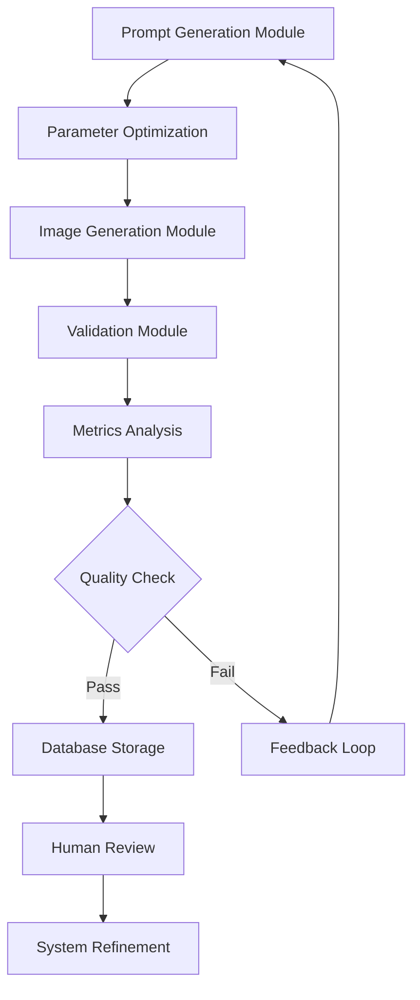

# Automated Visual Prompt Validation System: Multi-Model Architecture

## 1. System Architecture Overview

### 1.1 Core Components

1. **Prompt Generation Module (PGM)**
   - Primary LLM for prompt creation
   - Prompt structure validation
   - Parameter optimization

2. **Image Generation Module (IGM)**
   - Target generative model
   - Output management
   - Technical parameter tracking

3. **Validation and Analysis Module (VAM)**
   - Vision-language model for assessment
   - Metrics computation
   - Feedback aggregation

4. **Human-in-the-Loop Interface (HITL)**
   - Review interface
   - Feedback collection
   - Quality assurance

### 1.2 System Flow


## 2. Module Specifications

### 2.1 Prompt Generation Module (PGM)

#### Components
1. **Primary LLM Configuration**
```json
{
    "model_type": "GPT-4 or similar",
    "optimization_parameters": {
        "creativity_weight": 0.7,
        "technical_precision": 0.8,
        "style_consistency": 0.9
    },
    "prompt_structure": {
        "technical_elements": [],
        "style_elements": [],
        "composition_elements": []
    }
}
```

#### Functionality
1. **Prompt Creation Pipeline**
```python
class PromptGenerator:
    def generate_base_prompt(self, requirements):
        # Generate initial prompt structure
        pass

    def optimize_prompt(self, prompt, feedback):
        # Refine based on validation feedback
        pass

    def validate_structure(self, prompt):
        # Check prompt against guidelines
        pass
```

### 2.2 Image Generation Module (IGM)

#### Configuration
```json
{
    "model_settings": {
        "resolution": "1024x1024",
        "quality_level": "high",
        "sampling_steps": 50
    },
    "output_parameters": {
        "format": "png",
        "metadata_inclusion": true,
        "batch_size": 4
    }
}
```

#### Tracking System
```python
class GenerationTracker:
    def __init__(self):
        self.technical_params = {}
        self.generation_history = []
        self.error_logs = []

    def log_generation(self, prompt, result):
        # Log generation details
        pass

    def analyze_performance(self):
        # Compute generation metrics
        pass
```

### 2.3 Validation and Analysis Module (VAM)

#### Metrics Framework
```python
class ValidationMetrics:
    def __init__(self):
        self.technical_scores = {}
        self.aesthetic_scores = {}
        self.prompt_adherence = {}

    def compute_technical_quality(self, image):
        # Assess technical parameters
        pass

    def evaluate_aesthetic_quality(self, image):
        # Evaluate artistic elements
        pass

    def measure_prompt_alignment(self, prompt, image):
        # Check prompt-image correspondence
        pass
```

#### Vision-Language Model Integration
```python
class VisionLanguageValidator:
    def __init__(self, model_config):
        self.vlm = load_vision_language_model(model_config)
        self.metrics = ValidationMetrics()

    def analyze_image(self, image, prompt):
        technical_score = self.metrics.compute_technical_quality(image)
        aesthetic_score = self.metrics.evaluate_aesthetic_quality(image)
        alignment_score = self.metrics.measure_prompt_alignment(prompt, image)
        return {
            'technical': technical_score,
            'aesthetic': aesthetic_score,
            'alignment': alignment_score
        }
```

## 3. Workflow Implementation

### 3.1 Initialization Phase

1. **System Setup**
```python
def initialize_system():
    pgm = PromptGenerator()
    igm = ImageGenerator()
    vam = VisionLanguageValidator()
    return SystemPipeline(pgm, igm, vam)
```

2. **Parameter Configuration**
```python
def configure_parameters():
    config = {
        'prompt_generation': {
            'complexity_level': 'advanced',
            'style_specificity': 'high',
            'technical_detail': 'comprehensive'
        },
        'image_generation': {
            'quality_threshold': 0.8,
            'batch_size': 4,
            'iteration_limit': 5
        },
        'validation': {
            'minimum_scores': {
                'technical': 0.7,
                'aesthetic': 0.6,
                'alignment': 0.8
            }
        }
    }
    return config
```

### 3.2 Execution Flow

1. **Main Pipeline**
```python
class ValidationPipeline:
    def __init__(self, config):
        self.config = config
        self.pgm = PromptGenerator()
        self.igm = ImageGenerator()
        self.vam = VisionLanguageValidator()

    def execute_validation_cycle(self, requirements):
        # Generate prompt
        prompt = self.pgm.generate_base_prompt(requirements)

        # Generate images
        images = self.igm.generate_batch(prompt)

        # Validate results
        validation_results = [
            self.vam.analyze_image(img, prompt)
            for img in images
        ]

        # Process feedback
        self.process_feedback(validation_results)

        return validation_results
```

2. **Feedback Processing**
```python
def process_feedback(self, validation_results):
    for result in validation_results:
        if self.meets_thresholds(result):
            self.store_successful_case(result)
        else:
            self.generate_improvement_feedback(result)
```

### 3.3 Quality Assurance

1. **Automated Checks**
```python
class QualityChecker:
    def __init__(self, thresholds):
        self.thresholds = thresholds

    def check_technical_quality(self, image_data):
        # Verify technical parameters
        pass

    def verify_prompt_adherence(self, prompt, image):
        # Check prompt-image alignment
        pass

    def assess_aesthetic_quality(self, image):
        # Evaluate artistic elements
        pass
```

2. **Human Review Integration**
```python
class HumanReviewInterface:
    def __init__(self):
        self.review_queue = []
        self.feedback_history = {}

    def submit_for_review(self, generation_data):
        # Queue for human review
        pass

    def process_feedback(self, review_data):
        # Handle human feedback
        pass
```

## 4. Continuous Improvement

### 4.1 Learning System

1. **Feedback Integration**
```python
class FeedbackLearning:
    def __init__(self):
        self.success_patterns = {}
        self.failure_patterns = {}

    def analyze_patterns(self):
        # Identify successful and problematic patterns
        pass

    def update_generation_parameters(self):
        # Refine system parameters
        pass
```

2. **Pattern Recognition**
```python
class PatternAnalyzer:
    def __init__(self):
        self.pattern_database = {}

    def identify_patterns(self, generation_history):
        # Extract common patterns
        pass

    def update_guidelines(self):
        # Refine generation guidelines
        pass
```

### 4.2 System Optimization

1. **Performance Metrics**
```python
class SystemMetrics:
    def __init__(self):
        self.success_rate = 0
        self.iteration_counts = []
        self.quality_scores = []

    def update_metrics(self, validation_cycle):
        # Update system performance metrics
        pass

    def generate_report(self):
        # Create performance report
        pass
```

2. **Optimization Pipeline**
```python
class SystemOptimizer:
    def __init__(self, system_config):
        self.config = system_config
        self.metrics = SystemMetrics()

    def optimize_parameters(self):
        # Adjust system parameters
        pass

    def validate_improvements(self):
        # Verify optimization effects
        pass
```

## 5. Implementation Guidelines

### 5.1 Deployment Steps

1. Initialize system components
2. Configure baseline parameters
3. Implement validation pipeline
4. Set up human review interface
5. Deploy feedback system
6. Monitor and optimize

### 5.2 Best Practices

1. **Data Management**
   - Maintain comprehensive logs
   - Store all validation results
   - Track system modifications

2. **Quality Control**
   - Regular calibration checks
   - Periodic human validation
   - System performance reviews

3. **Optimization**
   - Continuous parameter refinement
   - Pattern analysis integration
   - Regular system updates

## 6. Conclusion

This automated validation system provides:
- Systematic prompt generation
- Reliable image validation
- Comprehensive quality metrics
- Continuous improvement framework

Success depends on:
1. Proper system configuration
2. Regular monitoring
3. Effective feedback integration
4. Continuous optimization
5. Human oversight

The system should be viewed as a living framework that evolves based on accumulated data and feedback.
