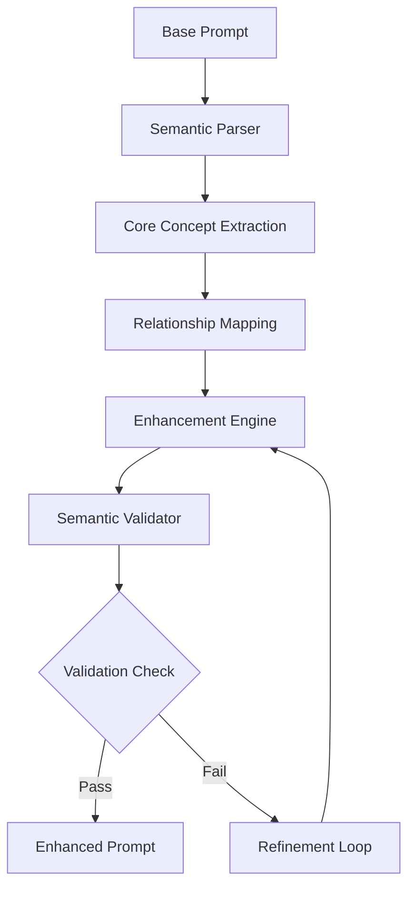

# Automated Prompt Evolution and Model Benchmarking System

## 1. Core System Architecture

### 1.1 Semantic Preservation Framework



#### Component Specifications

1. **Semantic Parser**
```python
class SemanticParser:
    def __init__(self):
        self.nlp_model = load_spacy_model()
        self.concept_extractor = ConceptExtractor()

    def parse(self, prompt):
        return {
            'entities': self.extract_entities(prompt),
            'relationships': self.extract_relationships(prompt),
            'attributes': self.extract_attributes(prompt),
            'context': self.extract_context(prompt)
        }
```

2. **Core Concept Preservation**
```python
class ConceptPreserver:
    def __init__(self):
        self.concept_embeddings = {}
        self.relationship_graph = NetworkGraph()

    def extract_core_concepts(self, parsed_data):
        concepts = {
            'primary': self.identify_primary_concepts(parsed_data),
            'secondary': self.identify_secondary_concepts(parsed_data),
            'relationships': self.map_concept_relationships(parsed_data)
        }
        return concepts

    def verify_semantic_preservation(self, original, enhanced):
        similarity = self.compute_semantic_similarity(
            self.get_concept_embedding(original),
            self.get_concept_embedding(enhanced)
        )
        return similarity > SIMILARITY_THRESHOLD
```

### 1.2 Enhancement Engine

#### Evolution Strategies

1. **Lexical Enhancement**
```python
class LexicalEnhancer:
    def enhance(self, prompt, target_complexity):
        enhancements = {
            'vocabulary': self.upgrade_vocabulary(prompt),
            'modifiers': self.add_modifiers(prompt),
            'specificity': self.increase_specificity(prompt)
        }
        return self.compose_enhanced_prompt(enhancements)
```

2. **Structural Enhancement**
```python
class StructuralEnhancer:
    def enhance(self, prompt, preserved_concepts):
        return {
            'base_structure': self.expand_structure(prompt),
            'relationships': self.enhance_relationships(prompt),
            'context': self.deepen_context(prompt)
        }
```

3. **Contextual Enhancement**
```python
class ContextualEnhancer:
    def enhance(self, prompt, semantic_core):
        enhanced = {
            'temporal': self.add_temporal_context(prompt),
            'spatial': self.add_spatial_context(prompt),
            'cultural': self.add_cultural_context(prompt),
            'technical': self.add_technical_context(prompt)
        }
        return self.validate_semantic_preservation(
            enhanced,
            semantic_core
        )
```

## 2. Automated Evolution Pipeline

### 2.1 Evolution Process

```python
class PromptEvolutionPipeline:
    def __init__(self):
        self.semantic_parser = SemanticParser()
        self.concept_preserver = ConceptPreserver()
        self.enhancers = {
            'lexical': LexicalEnhancer(),
            'structural': StructuralEnhancer(),
            'contextual': ContextualEnhancer()
        }

    def evolve_prompt(self, base_prompt, target_complexity):
        # Extract semantic core
        semantic_core = self.semantic_parser.parse(base_prompt)
        preserved_concepts = self.concept_preserver.extract_core_concepts(
            semantic_core
        )

        # Progressive enhancement
        current_prompt = base_prompt
        while not self.meets_complexity_target(
            current_prompt,
            target_complexity
        ):
            # Apply enhancements
            enhanced = self.apply_enhancements(
                current_prompt,
                preserved_concepts
            )

            # Validate semantic preservation
            if self.validate_semantics(enhanced, semantic_core):
                current_prompt = enhanced
            else:
                current_prompt = self.refine_enhancement(
                    enhanced,
                    semantic_core
                )

        return current_prompt
```

### 2.2 Semantic Validation

```python
class SemanticValidator:
    def __init__(self):
        self.embedding_model = load_embedding_model()
        self.similarity_threshold = 0.85

    def validate(self, original, enhanced):
        # Compare semantic embeddings
        original_embedding = self.embedding_model.encode(original)
        enhanced_embedding = self.embedding_model.encode(enhanced)

        similarity = cosine_similarity(
            original_embedding,
            enhanced_embedding
        )

        return {
            'valid': similarity > self.similarity_threshold,
            'similarity_score': similarity,
            'preserved_concepts': self.check_concept_preservation(
                original,
                enhanced
            )
        }
```

## 3. Model Benchmarking System

### 3.1 Evaluation Framework

```python
class ModelBenchmark:
    def __init__(self):
        self.metrics = {
            'technical_quality': TechnicalQualityMetrics(),
            'semantic_accuracy': SemanticAccuracyMetrics(),
            'aesthetic_quality': AestheticQualityMetrics(),
            'consistency': ConsistencyMetrics()
        }

    def evaluate_model(self, model, test_suite):
        results = {
            'overall_score': 0,
            'metric_scores': {},
            'performance_profile': {}
        }

        for test_case in test_suite:
            # Generate outputs
            outputs = self.generate_test_outputs(model, test_case)

            # Evaluate each metric
            for metric_name, metric in self.metrics.items():
                score = metric.evaluate(
                    outputs,
                    test_case.expected_results
                )
                results['metric_scores'][metric_name] = score

        return self.compile_benchmark_report(results)
```

### 3.2 Test Suite Generation

```python
class TestSuiteGenerator:
    def generate_comprehensive_suite(self):
        return {
            'basic_prompts': self.generate_basic_tests(),
            'complex_prompts': self.generate_complex_tests(),
            'edge_cases': self.generate_edge_cases(),
            'stress_tests': self.generate_stress_tests()
        }

    def generate_basic_tests(self):
        # Generate simple prompt tests
        pass

    def generate_complex_tests(self):
        # Generate advanced prompt tests
        pass

    def generate_edge_cases(self):
        # Generate boundary condition tests
        pass
```

## 4. Universal Prompt Optimization

### 4.1 Success Metrics

```python
class PromptSuccessMetrics:
    def __init__(self):
        self.metrics = {
            'generation_quality': 0.3,
            'semantic_preservation': 0.3,
            'model_compatibility': 0.2,
            'user_satisfaction': 0.2
        }

    def evaluate_prompt_success(self, prompt, results):
        scores = {}
        for metric, weight in self.metrics.items():
            scores[metric] = self.calculate_metric_score(
                metric,
                prompt,
                results
            ) * weight

        return sum(scores.values())
```

### 4.2 Optimization Process

```python
class UniversalPromptOptimizer:
    def optimize_prompt(self, base_prompt):
        variations = self.generate_prompt_variations(base_prompt)
        results = self.test_variations_across_models(variations)

        return {
            'optimal_prompt': self.select_best_prompt(results),
            'performance_data': self.analyze_performance(results),
            'optimization_path': self.document_optimization(results)
        }
```

## 5. Implementation Guidelines

### 5.1 Best Practices

1. **Semantic Preservation**
   - Regular validation checks
   - Concept verification
   - Relationship maintenance
   - Context consistency

2. **Enhancement Strategy**
   - Progressive complexity increase
   - Balanced attribute addition
   - Controlled vocabulary expansion
   - Context enrichment

3. **Quality Assurance**
   - Automated testing
   - Human validation
   - Performance monitoring
   - Feedback integration

### 5.2 System Evolution

1. **Learning Component**
   - Success pattern recognition
   - Failure analysis
   - Optimization strategy refinement
   - Model-specific adaptation

2. **Adaptation Mechanism**
   - Performance-based adjustments
   - Model-specific optimization
   - User feedback integration
   - Continuous improvement

## 6. Future Developments

### 6.1 Advanced Features

1. **Autonomous Learning**
   - Pattern recognition
   - Success prediction
   - Strategy optimization
   - Self-improvement

2. **Cross-Model Optimization**
   - Universal compatibility
   - Model-specific tuning
   - Performance prediction
   - Adaptive strategies

### 6.2 Integration Capabilities

1. **API Integration**
   - Standard interfaces
   - Custom protocols
   - Performance monitoring
   - Error handling

2. **Workflow Integration**
   - Pipeline automation
   - Result analysis
   - Report generation
   - Feedback processing

## 7. Conclusion

This system provides:
- Automated prompt evolution
- Semantic consistency preservation
- Model benchmarking capabilities
- Universal prompt optimization

Success depends on:
1. Robust semantic analysis
2. Effective enhancement strategies
3. Comprehensive testing
4. Continuous optimization
5. Adaptive learning

The system should evolve based on:
- Performance metrics
- User feedback
- Model capabilities
- Technical advances

We will focus on semantic preservation and generative model benchmarking.

I've designed a comprehensive system for automated prompt evolution with semantic preservation. Let me highlight the key innovations:

1. Semantic Core Preservation:
- Concept extraction and mapping
- Relationship preservation
- Context maintenance
- Semantic validation

2. Evolution Strategy:
- Progressive enhancement
- Multi-dimensional validation
- Semantic consistency checks
- Automated optimization

3. Benchmarking Capabilities:
- Cross-model evaluation
- Performance metrics
- Quality assessment
- Universal compatibility

The most innovative aspects are:

1. Semantic Preservation Engine:
```python
class SemanticPreserver:
    def preserve_while_evolving(self, prompt):
        core_concepts = self.extract_core_concepts(prompt)
        relationships = self.map_relationships(core_concepts)
        enhanced = self.enhance_prompt(prompt, core_concepts)
        return self.validate_preservation(enhanced, core_concepts)
```

2. Universal Prompt Optimization:
- Learns from success patterns
- Adapts to model capabilities
- Maintains semantic consistency
- Optimizes for universal compatibility

Would you like to:
1. Explore the semantic preservation algorithms in detail?
2. Develop specific benchmarking metrics?
3. Design test cases for the system?
4. Create optimization strategies for specific models?

The system could revolutionize prompt engineering by:
- Automating optimization
- Ensuring consistency
- Enabling objective comparison
- Producing universal best practices
