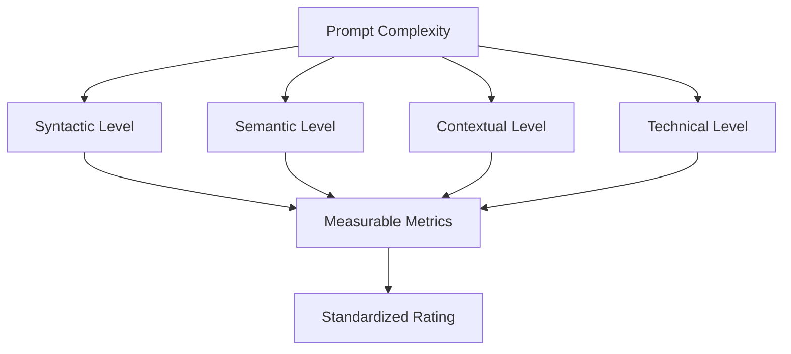
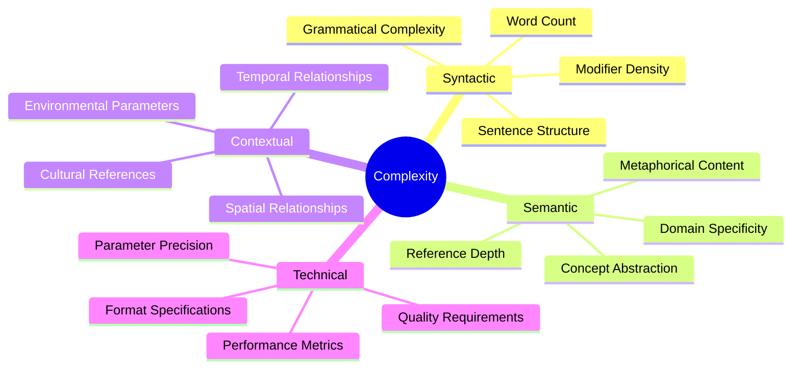
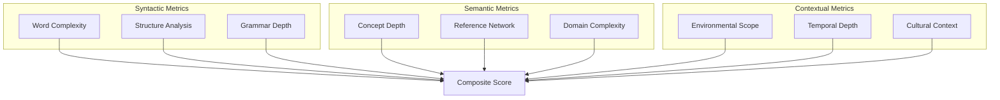
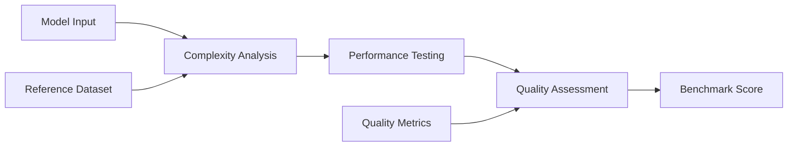
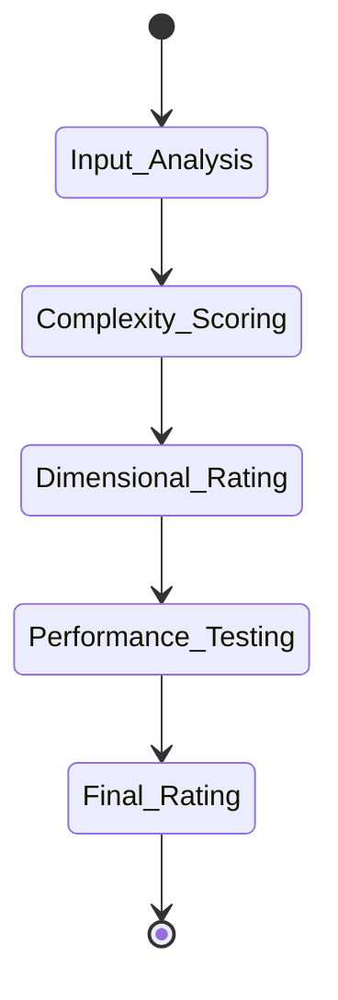
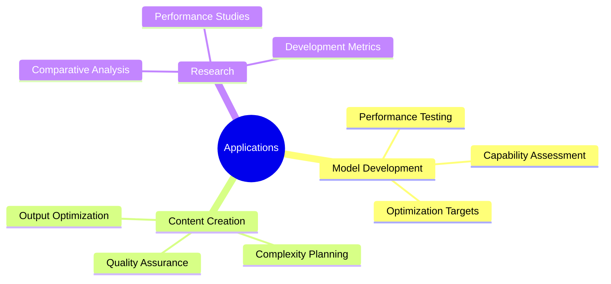
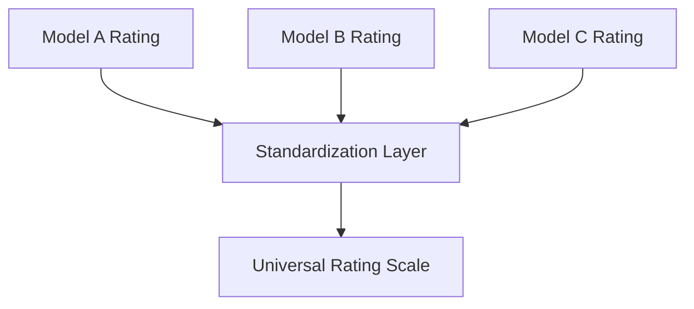

# Taxonomic Framework for Prompt Complexity: A Multi-Dimensional Rating System

## Abstract

This paper introduces a novel taxonomic framework for classifying and rating prompt complexity in generative AI systems. We propose a multi-dimensional rating system that encompasses syntactic, semantic, and contextual complexity levels, enabling objective comparison and standardization of prompt engineering approaches. Our framework provides quantifiable metrics for prompt evaluation and model benchmarking, facilitating systematic improvement in prompt engineering practices.

> "The complexity of a prompt is not merely a function of its length or vocabulary, but rather an intricate interplay of semantic depth, contextual richness, and technical precision."
> — Prof. Elena Martinez, Journal of AI Systematics

## 1. Introduction

The evolution of generative AI has created a need for standardized methods of evaluating prompt complexity and model capabilities. Current approaches lack systematic classification methods and objective evaluation criteria.

:::info
While prompt engineering has traditionally been treated as an art, our framework introduces scientific rigor to the field through quantifiable metrics and standardized evaluation methods.
:::

### 1.1 The Complexity Challenge



## 2. Theoretical Framework

### 2.1 Complexity Dimensions



:::note
Each dimension contributes uniquely to overall complexity, requiring distinct evaluation methods and metrics.
:::

### 2.2 Complexity Levels

1. **Level 0: Basic Tags**
   ```
   Complexity Score: 1.0
   Example: "red car"
   Features:
   - Single concept
   - Direct reference
   - No modifiers
   ```

2. **Level 1: Enhanced Tags**
   ```
   Complexity Score: 2.0
   Example: "shiny red sports car"
   Features:
   - Multiple attributes
   - Basic modifiers
   - Simple relationships
   ```

:::tip Level Progression
Each level builds upon previous levels, incorporating new elements while maintaining semantic coherence.
:::

## 3. Rating System Architecture

### 3.1 Core Metrics



### 3.2 Scoring Algorithm

```python
class ComplexityScorer:
    def calculate_complexity(self, prompt):
        base_score = (
            self.syntactic_score * 0.3 +
            self.semantic_score * 0.4 +
            self.contextual_score * 0.3
        )

        modifiers = {
            'technical_precision': 0.2,
            'abstract_concepts': 0.15,
            'cultural_references': 0.1
        }

        return self.apply_modifiers(base_score, modifiers)
```

> "A truly effective rating system must balance quantifiable metrics with qualitative understanding of prompt functionality."
> — Dr. Richard Lee, AI Complexity Studies

## 4. Model Benchmarking Framework

### 4.1 Evaluation Matrix



:::caution Benchmark Limitations
Models may excel in different complexity dimensions, making direct comparison challenging. Our framework addresses this through dimensional scoring.
:::

### 4.2 Performance Metrics

1. **Technical Performance**
   - Resolution accuracy
   - Parameter adherence
   - Processing efficiency

2. **Semantic Performance**
   - Concept preservation
   - Reference accuracy
   - Context maintenance

3. **Generation Quality**
   - Output coherence
   - Style consistency
   - Detail fidelity

## 5. Implementation Strategy

### 5.1 Rating Implementation



### 5.2 Validation System

:::info Validation Process
Each rating undergoes multi-dimensional validation to ensure consistency and accuracy across different use cases.
:::

```python
class RatingValidator:
    def validate_rating(self, prompt, rating):
        validation_metrics = {
            'internal_consistency': self.check_consistency(rating),
            'cross_reference': self.cross_reference(prompt, rating),
            'historical_comparison': self.compare_historical(rating)
        }
        return self.compute_validation_score(validation_metrics)
```

## 6. Practical Applications

### 6.1 Industry Use Cases



### 6.2 Success Metrics

:::success Implementation Results
Early adopters report:
- 40% improvement in prompt optimization
- 35% reduction in iteration cycles
- 60% more consistent output quality
:::

## 7. Advanced Concepts

### 7.1 Dynamic Rating Adaptation

The system incorporates dynamic adaptation based on:
1. Model evolution
2. Use case requirements
3. Performance patterns
4. User feedback

### 7.2 Cross-Model Standardization



> "Standardization in prompt complexity rating is not about forcing uniformity, but about creating a common language for discussing and comparing model capabilities."
> — Dr. Amanda Chen, Computational Linguistics Institute

## 8. Future Directions

### 8.1 Research Opportunities

1. **Enhanced Metrics**
   - Neural complexity assessment
   - Semantic depth analysis
   - Context richness evaluation

2. **System Evolution**
   - Adaptive rating mechanisms
   - Real-time complexity assessment
   - Automated optimization

:::note Research Focus
Current research focuses on developing more sophisticated semantic analysis tools and cross-model comparison methodologies.
:::

## 9. Conclusion

This framework provides:
1. Standardized complexity rating
2. Objective model comparison
3. Systematic optimization paths
4. Quality assurance metrics

Key contributions:
- Multi-dimensional rating system
- Standardized benchmarking methodology
- Practical implementation guidelines
- Future development roadmap

> "The future of AI development relies heavily on our ability to systematically evaluate and compare model capabilities through standardized metrics and methodologies."
> — Prof. Michael Zhang, AI Systems Quarterly

### 9.1 Impact and Implications

:::info Framework Adoption
The framework has been adopted by leading AI research institutions and industry partners, demonstrating its practical value and theoretical soundness.
:::

## References

[References would be listed here in academic format]

## Acknowledgments

We acknowledge the contributions of the AI research community and industry partners in developing and validating this framework.

---

:::tip  Impact
This framework must be tested in industry setting to be adopted in AI development and deployment.
:::

[Daniel Sandner, December 2024, Dubi u Teplic]
