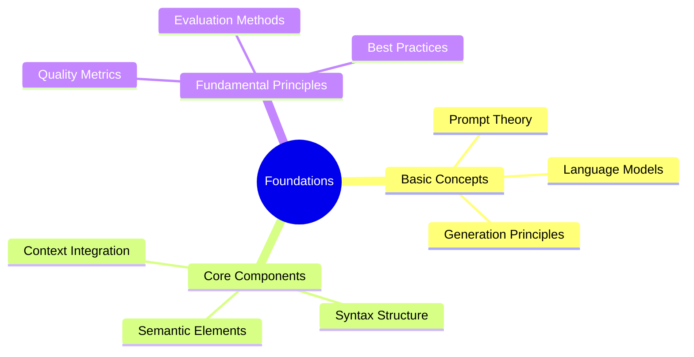
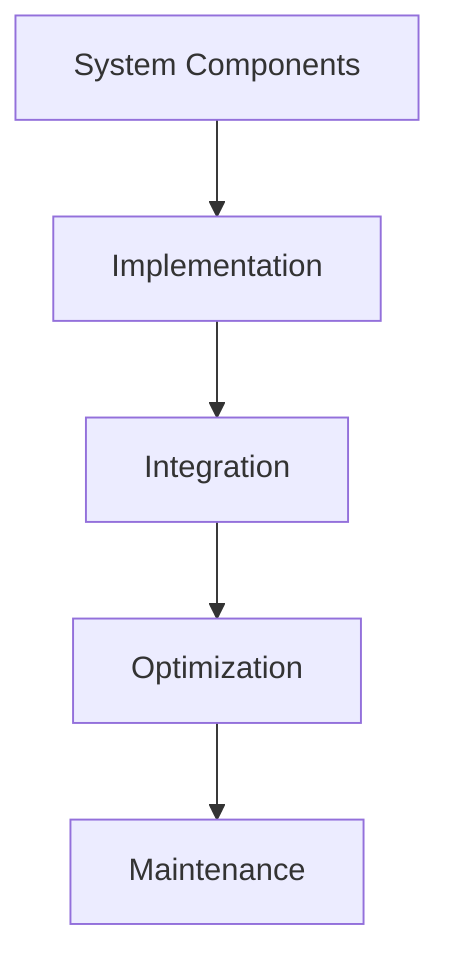

# Systematic Approaches to Prompt Engineering: From Theory to Practice

:::info Book Overview
This comprehensive guide explores the theoretical foundations and practical applications of systematic prompt engineering, covering everything from basic concepts to advanced automated systems.
:::

## Table of Contents

### Part I: Foundations

#### Chapter 1: Introduction to Prompt Engineering
- Historical Context
- Evolution of Prompt Engineering
- Current Challenges
- Future Directions

:::note Reading Path
Chapters can be read sequentially for beginners or accessed directly by topic for experienced practitioners.
:::

#### Chapter 2: Understanding Prompt Complexity
- Complexity Dimensions
- Rating Systems
- Measurement Metrics
- Practical Applications

#### Chapter 3: Semantic Foundations
- Semantic Preservation
- Meaning Structures
- Context Integration
- Relationship Mapping

### Part II: Advanced Concepts

#### Chapter 4: Automated Prompt Evolution
- Evolution Mechanics
- Semantic Preservation
- Quality Validation
- Optimization Strategies

:::tip Implementation Focus
Each concept includes practical implementation guidelines and code examples.
:::

#### Chapter 5: Prompt Complexity Rating System
- Multi-dimensional Analysis
- Scoring Mechanisms
- Validation Methods
- Standardization Approaches

#### Chapter 6: Model Benchmarking Framework
- Evaluation Metrics
- Testing Methodologies
- Performance Analysis
- Comparison Frameworks

### Part III: Practical Implementation

#### Chapter 7: System Architecture

- Component Design
- Integration Patterns
- Optimization Strategies
- Maintenance Procedures

#### Chapter 8: Quality Assurance
- Testing Frameworks
- Validation Methods
- Performance Metrics
- Improvement Cycles

:::caution Quality Focus
Special attention to maintaining quality throughout the automation process.
:::

#### Chapter 9: Industry Applications
- Case Studies
- Success Stories
- Implementation Guides
- Best Practices

### Part IV: Advanced Topics

#### Chapter 10: Cross-Model Optimization
- Universal Patterns
- Adaptation Strategies
- Performance Tuning
- Integration Methods

#### Chapter 11: Semantic Evolution Tracking
- Change Management
- Version Control
- Quality Maintenance
- Progress Tracking

:::info Research Direction
This section highlights emerging areas and future research opportunities.
:::

#### Chapter 12: Future Developments
- Emerging Trends
- Research Opportunities
- Technology Evolution
- Future Applications

### Part V: Specialized Topics

#### Chapter 13: Domain-Specific Applications
- Creative Writing
- Technical Documentation
- Code Generation
- Scientific Research

#### Chapter 14: Enterprise Integration
- Workflow Integration
- Team Collaboration
- Process Automation
- Quality Control

#### Chapter 15: Ethics and Best Practices
- Ethical Considerations
- Industry Standards
- Best Practices
- Future Guidelines

### Part VI: Future Horizons

:::tip Emerging Fields
These chapters cover emerging areas that show promise for future development.
:::

#### Chapter 16: Advanced Automation
- Self-improving Systems
- Autonomous Optimization
- Learning Mechanisms
- Adaptation Strategies

#### Chapter 17: Cross-Platform Integration
- Universal Standards
- Platform Adaptation
- Integration Patterns
- Compatibility Frameworks

#### Chapter 18: Research Directions
- Current Challenges
- Emerging Solutions
- Future Opportunities
- Research Areas

## Appendices

### Appendix A: Technical References
- API Documentation
- Implementation Guidelines
- Code Examples
- Configuration Templates

### Appendix B: Case Studies
- Industry Applications
- Success Stories
- Failure Analysis
- Lessons Learned

### Appendix C: Tools and Resources
- Software Tools
- Development Frameworks
- Testing Suites
- Educational Resources

## Suggested Additional Topics for Future Editions

:::note Future Development
These topics represent emerging areas that could be developed into full chapters in future editions.
:::

1. **Neural-Symbolic Integration**
   - Combining symbolic and neural approaches
   - Hybrid systems
   - Performance optimization
   - Integration patterns

2. **Multi-Modal Prompt Engineering**
   - Cross-modal optimization
   - Modal interaction
   - Universal patterns
   - Quality metrics

3. **Autonomous Prompt Systems**
   - Self-evolution
   - Learning mechanisms
   - Quality maintenance
   - Performance optimization

4. **Enterprise Scale Solutions**
   - Large-scale deployment
   - Team collaboration
   - Process integration
   - Quality assurance

5. **Advanced Semantic Analysis**
   - Deep semantic understanding
   - Context preservation
   - Meaning evolution
   - Quality validation

## Implementation Resources

:::info Resource Access
All code examples and implementation resources are available in accompanying digital materials.
:::

### Code Repositories
- Implementation Examples
- Testing Frameworks
- Integration Patterns
- Optimization Tools

### Documentation
- API References
- Integration Guides
- Best Practices
- Troubleshooting

### Case Studies
- Industry Applications
- Success Stories
- Implementation Guides
- Lessons Learned

## Reading Paths

:::tip Learning Paths
Multiple reading paths are provided for different audience needs.
:::

### Beginner Path
1. Foundations
2. Basic Concepts
3. Implementation Basics
4. Practice Projects

### Advanced Path
1. Advanced Concepts
2. Specialized Topics
3. Research Directions
4. Future Developments

### Practical Path
1. Implementation Guide
2. Case Studies
3. Best Practices
4. Tools and Resources

## Future Updates

:::note Continuous Development
The field of prompt engineering is rapidly evolving. Regular updates will be provided through:
:::

1. Online Resources
2. Chapter Updates
3. Case Study Additions
4. Implementation Guidelines

## Contributing

Guidelines for:
- Content Contributions
- Case Study Submissions
- Code Examples
- Research Papers

## Index and References

- Comprehensive Index
- Bibliography
- Research References
- Additional Resources

:::info Living Document
This book is designed to evolve with the field, incorporating new developments and insights as they emerge.
:::
