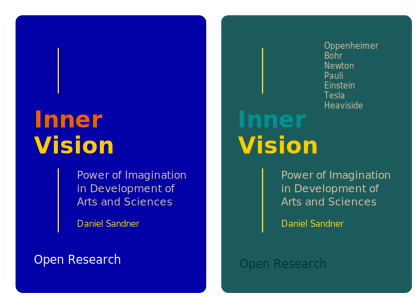

# Inner Vision
## Abstract

Imagination and its influence on development of arts and sciences. Phenomenology of inner vision in history of spiritual and intellectual explorations

## Cover

## What's next?

- Scientific exploration and religious beliefs
- Inner vision in ancient society (Asia, Africa, Europe, and American Cultures)
- Inner vision in works of Pauli, Oppenheimer, Einstein, Bohr, Tesla, Heaviside, Newton, Goethe, Hildegard von Bingen, Boehm, Bacon, Komenský, Dee, Fludd, Llull, Kepler, Avicenna, Plato, Euclid, Archimedes, Al-Khwarizmi, Al-Razi  
- visual cortex and intellectual capacity
