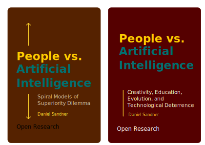

# People vs. Artificial Intelligence: Creativity, Education, Evolution, and Technological Deterrence

## Abstract

Can Machine Manipulate Human? Who is afraid of AI, and who is really in danger? Is reality imitating art? A brief treatise on development of AI, perspectives of General Artificial Intelligence and how it will change the world.

## Cover

## What's next?

- How technology mimics human mind
- Action and reaction in AI research
- False and real dangers of AI
- Evolutional jumps and its relation to technology
- Who is afraid of AI?
- Media and Techno-terrorism
- Media manipulations and development of false realities
- Personification of problems and solutions
- Parasitic ideologies and useful idiots, media appendages
- Instant stooges (which do not know their role in the script) and sculpting the audience impressions
- How to validate information in age of AI
- Is AI the only solution for sustainable development?
- Perspectives of AI
