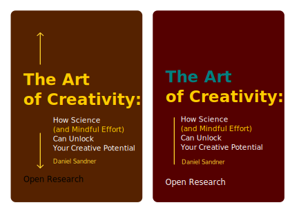

# The Art of Creativity: How Science Can Unlock Your Creative Potential

## Abstract

Can Machine Manipulate Human? Who is afraid of AI, and who is really in danger? Is reality imitating art? A brief treatise on development of AI, perspectives of General Artificial Intelligence and how it will change the world.

## Cover

## Outline

### Introduction
Explain the main goal of the book: to help readers understand the science behind creativity and how to apply it to their own lives.Define creativity as the ability to generate novel and useful ideas, products or solutions.Provide some examples of creative achievements in various domains, such as art, literature, music, science, technology, etc.Highlight the benefits of creativity for personal and professional growth, happiness and well-being.Preview the main topics and chapters of the book.

### Chapter 1: The Creative Brain
Describe the brain structures and functions involved in creativity, such as the prefrontal cortex, the temporal lobes, the default mode network, etc.Explain how different types of thinking (divergent and convergent) and cognitive processes (attention, memory, association, etc.) contribute to creativity.Discuss the role of neurochemicals (such as dopamine, serotonin, etc.) and hormones (such as cortisol, testosterone, etc.) in modulating creativity.Provide some tips and exercises to enhance brain health and function for creativity.

### Chapter 2: The Creative Personality
Describe the personality traits and characteristics that are associated with creativity, such as openness to experience, curiosity, risk-taking, tolerance for ambiguity, etc.Explain how personality influences creative motivation, style and expression.Discuss the role of environmental factors (such as culture, education, family, peers, etc.) in shaping personality and creativity.Provide some tips and exercises to develop a creative mindset and attitude.

### Chapter 3: The Creative Process
Describe the stages and phases of the creative process, such as preparation, incubation, illumination and verification.Explain how different strategies and techniques can facilitate each stage of the creative process, such as brainstorming, mind mapping, analogies, etc.Discuss the role of emotions (such as joy, frustration, anxiety, etc.) and moods (such as positive or negative affect) in influencing creativity.Provide some tips and exercises to optimize the creative process and overcome creative blocks.

### Chapter 4: The Creative Environment
Describe the physical and social factors that affect creativity, such as noise, lighting, temperature, space, etc.Explain how different types of environments (such as home, office, nature, etc.) can stimulate or inhibit creativity.Discuss the role of collaboration (such as teamwork, feedback, mentoring, etc.) and competition (such as rewards, recognition, challenges, etc.) in enhancing or hindering creativity.Provide some tips and exercises to create a conducive environment for creativity.

### Chapter 5: The Creative Application
Describe the various domains and fields where creativity can be applied and valued, such as art, science, business, education, etc.
Explain how different forms and formats of creative expression (such as writing, painting, music, etc.) can communicate and impact the audience.Discuss the role of innovation (such as novelty, originality, usefulness, etc.) and evaluation (such as criteria, standards, judgment, etc.) in determining the quality and success of creative products or solutions.Provide some tips and exercises to improve creative skills and performance.

### Conclusion
Summarize the main points and takeaways of the book.Emphasize the importance and benefits of creativity for personal and social development.Encourage readers to continue exploring and experimenting with their own creativity.Provide some resources and references for further learning and inspiration.

## What's next?

- Creativity and Design Thinking
- Creativity in a Professional Setting
