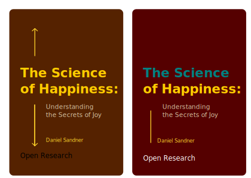

# The Science of Happiness: Understanding the Secrets of Joy

## Abstract

Is happiness a scientific fact? How to battle fears and prevail.

## Cover

### Outline

#### Introduction:

- Reasons to write this book
- The importance of happiness in our lives
- The science behind happiness
- The purpose of the book and how to read it

#### Chapter 1: The Neuroscience of Happiness
- The role of neurotransmitters in happiness
- The brain structures involved in happiness
- The connection between happiness and physical health

#### Chapter 2: The Psychology of Happiness
- The different theories of happiness
- The importance of gratitude, mindfulness, and positive thinking
- The benefits of social connections and relationships

#### Chapter 3: The Physiology of Happiness
- The impact of exercise and physical activity on happiness
- The role of nutrition and sleep in happiness
- The benefits of meditation and relaxation techniques

#### Chapter 4: The Sociology of Happiness
- The influence of culture and society on happiness
- The role of income and social status in happiness
- The importance of work-life balance and meaningful activities

#### Chapter 5: The Future of Happiness and the Controversies
- The potential of technology in promoting happiness
- The challenges and opportunities of pursuing happiness and principle of action and reaction
- The role of policy and governance in promoting (or proclaiming) happiness
- Happiness and prosperity

#### Conclusion:
- The key takeaways from the book
- The call to action to live a happier life
- The hope for a happier and more fulfilling future

This outline follows a logical progression from the basics of happiness to the more complex and interdisciplinary aspects of the topic. It also includes practical tips and techniques for readers to apply in their everyday lives. By addressing different aspects of happiness, this book can appeal to a wide range of readers, from those interested in science and psychology to those seeking self-improvement and personal growth.

## What's next?

- Roots and Development of Applied Psychology
- Neuroscience and Positive Thinking
- Parasitic Ideologies and What to Avoid
- Models of Thinking
- Is AI the only solution for sustainable development?
- Perspectives of AI
