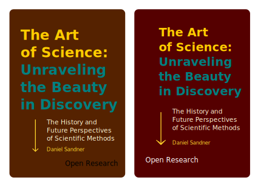

# The Art of Science: Unraveling the Beauty in Discovery

## Abstract

Scientific method and fostering creativity in scientific research.

## Cover

## Introduction (Outline)
- Introducing the intersection of art and science
- The importance of creativity in scientific progress
- Overview of the book's content and structure

### Chapter 1: The Art of Observation
- The role of observation in science
- Techniques for honing observational skills
- Examples of scientific discoveries made through careful observation
- Visual representation in scientific observation (illustrations, diagrams)

### Chapter 2: The Beauty of Patterns
- The significance of patterns in science
- The Fibonacci sequence and the Golden Ratio in nature
- Fractals and their applications
- The art of creating scientific patterns (data visualization, infographics)

### Chapter 3: The Creative Process in Scientific Discovery
- The role of imagination in scientific hypothesis formation
- Historical examples of creative scientific breakthroughs
- The importance of unconventional thinking
- Techniques for fostering creativity in scientific research

### Chapter 4: The Aesthetics of Scientific Instruments
- The design of scientific instruments and their impact on research
- Examples of beautifully designed scientific instruments
- The role of art in designing functional and appealing instruments
- The future of scientific instrument design

### Chapter 5: Science in Art
- The influence of scientific discoveries on art movements
- Examples of science-inspired art
- The role of science in understanding and conserving art
- The use of scientific techniques in art creation (e.g., 3D printing, holography)

### Chapter 6: The Science of Color
- The physics of color and how it is perceived
- The role of color in scientific research and communication
- The psychology of color in art and design
- Innovative use of color in scientific visualization

### Chapter 7: The Art of Scientific Communication
- The importance of effective communication in science
- The role of storytelling in engaging audiences
- The use of visual aids

## What's next?

- How our technology and scientific procedures mimics human mind
- Action and reaction in scientific research
- Perspectives of scientific methods
